# Compte Bancaire Microservice

* **Étudiante :** Majri Salma Master SDIA 2
* **Encadrant :** Prof. Mohamed Youssfi
* Activité Pratique N°1 - Implémentation d'un micro service avec spring boot

Application Spring Boot complète pour la gestion de comptes bancaires et de clients, développée pas à pas avec persistance JPA, API RESTful, documentation Swagger, projections Spring Data REST, et API GraphQL.

## Table des Matières
1. [Description du Projet](#description-du-projet)
2. [Technologies Utilisées](#technologies-utilisées)
3. [Architecture et Étapes de Réalisation](#architecture-et-étapes-de-réalisation)
4. [Tests des API REST (Postman & Swagger)](#tests-des-api-rest-postman--swagger)
5. [Projections Spring Data REST](#projections-spring-data-rest)
6. [API GraphQL & Gestion des Erreurs](#api-graphql--gestion-des-erreurs)

---

## 1. Description du Projet
Ce projet consiste en la création d'un microservice bancaire permettant de gérer des comptes et des clients. Il met en œuvre les bonnes pratiques de développement avec Spring Boot, l'exposition de services REST et GraphQL, ainsi que la gestion centralisée des exceptions.

---

## 2. Technologies Utilisées
* Java / Spring Boot
* Spring Data JPA (Hibernate)
* Base de données H2 (In-memory)
* Lombok
* Springdoc OpenAPI / Swagger UI
* Spring GraphQL

---

## 3. Architecture et Étapes de Réalisation
1. Création du projet Spring Boot avec les dépendances Web, Spring Data JPA, H2 et Lombok.
2. Création de l'entité JPA `BankAccount` et de l'entité `Customer`.
3. Création des interfaces `BankAccountRepository` et `CustomerRepository` basées sur Spring Data.
4. Implémentation des DTOs, des mappers et de la couche service (métier).
5. Exposition des API RESTful et configuration de la documentation Swagger.
6. Intégration de Spring Data REST avec l'utilisation de projections.
7. Développement de l'API GraphQL pour les requêtes et mutations avec gestion personnalisée des erreurs.

---

## 4. Tests des API REST & Documentation

### Test via Postman (Création et Consultation)
* **Création d'un compte (POST) :** Envoi d'une requête JSON à l'endpoint `/bankAccounts` pour enregistrer un nouveau compte.
* **Consultation des comptes (GET) :** Récupération de la liste de tous les comptes enregistrés.

| Création de Compte (POST) | Liste des Comptes (GET) |
| :---: | :---: |
| 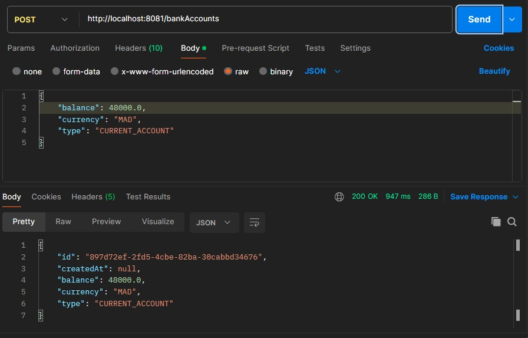 | 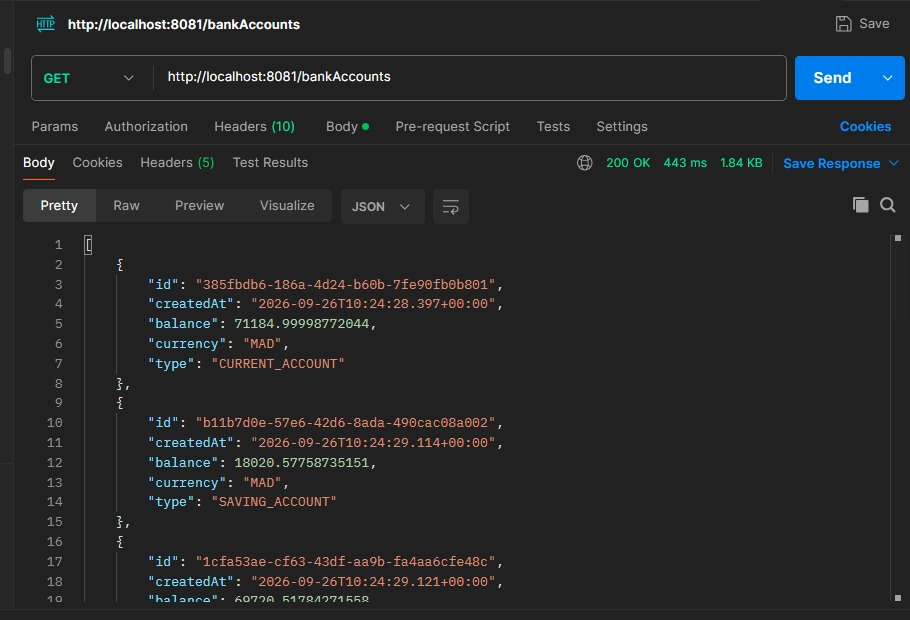 |

### Documentation Swagger UI & OpenAPI
L'interface Swagger permet de visualiser et d'interagir directement avec les endpoints REST du microservice.

| Documentation OpenAPI (JSON) | Interface Swagger UI |
| :---: | :---: |
| 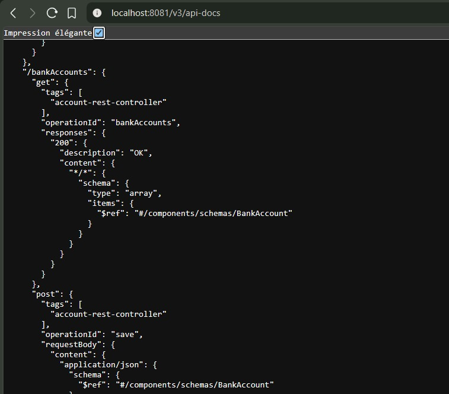 | 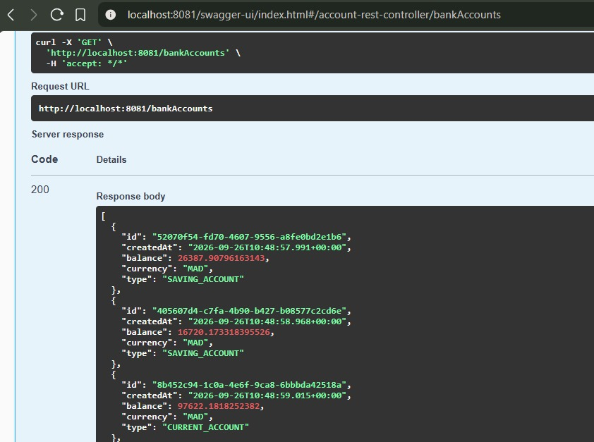 |

* **Détails d'un compte via Swagger :**

| Consultation par ID (Swagger) | Exécution d'une requête POST (Swagger) |
| :---: | :---: |
| 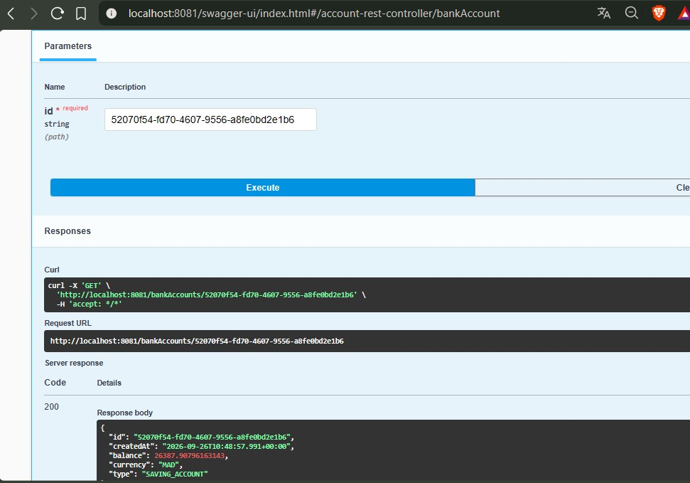 | 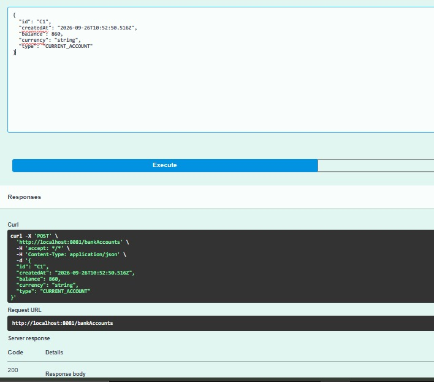 |

---

## 5. Projections Spring Data REST
Spring Data REST permet d'exposer directement les repositories tout en contrôlant les formats de sortie grâce aux projections.

* **Recherche par type de compte (`findByType`) :**

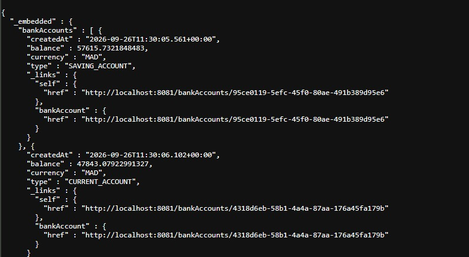

* **Utilisation d'une projection personnalisée (`projection=p1`) :**

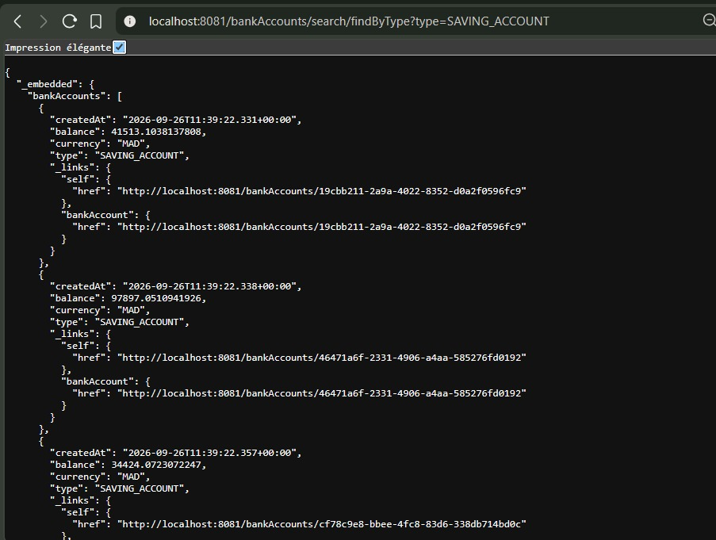

---

## 6. API GraphQL & Gestion des Erreurs
L'API GraphQL offre une flexibilité totale dans la récupération des données à travers des requêtes ciblées et des mutations sécurisées.

* **Récupération de la liste des comptes :**

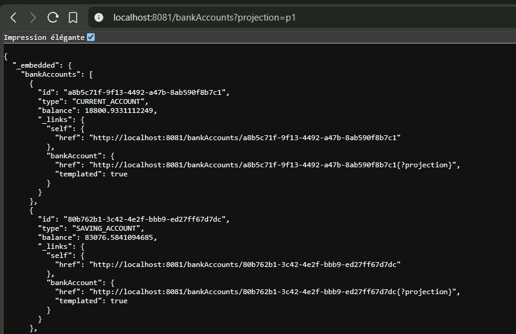

* **Recherche d'un compte par son identifiant (`bankAccountById`) :**

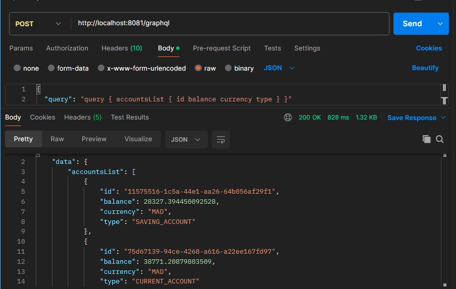

* **Gestion personnalisée des erreurs GraphQL (ID introuvable ou invalide) :**

| Erreur Interne (ID non trouvé) | Message d'Erreur Personnalisé |
| :---: | :---: |
| 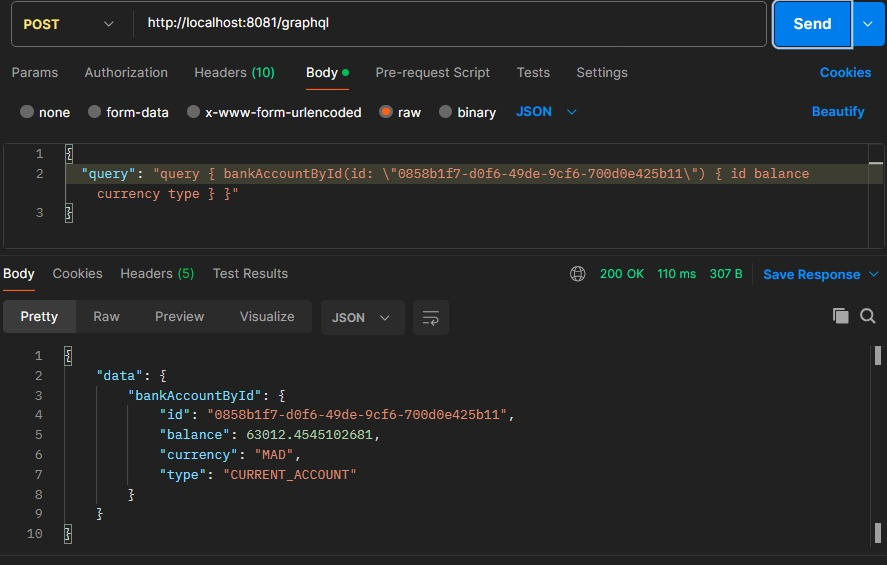 | 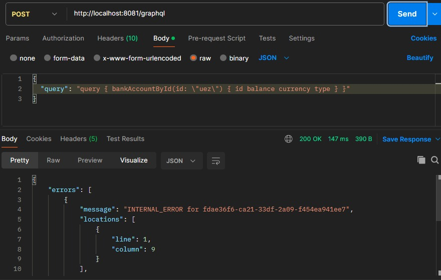 |